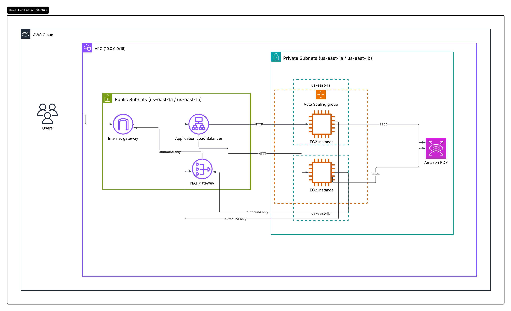

# Three-Tier AWS Web Application (Terraform)

This is a three-tier setup on AWS, built with Terraform. There's a VPC with public and private subnets across two Availability Zones, a load balancer that's the only thing actually exposed to the internet, an Auto Scaling Group of EC2 instances running the app, and an RDS MySQL database sitting behind everything else.

This was my first time actually writing Terraform from scratch instead of clicking through the AWS console. I'm planning on tearing it down and rebuilding it a few more times over the next few weeks so the syntax actually sticks instead of just working once and me forgetting how I did it.



---

## Why it's split into layers

If the servers and the database are all just sitting in one flat network, anything that can reach the internet can eventually reach the database too. Splitting it into layers means only the load balancer is actually reachable from outside. Everything else is hidden behind it, and each layer only accepts traffic from the layer right in front of it.

---

## What's actually in it

- VPC (`10.0.0.0/16`) spread across `us-east-1a` and `us-east-1b`
- Public subnets hold the load balancer and the NAT Gateway
- Private subnets hold the EC2 instances and the database
- Internet Gateway so the public side can reach the internet, NAT Gateway so the private side can reach out (updates, etc.) without anything being able to reach in
- Load balancer sending traffic to an Auto Scaling Group of EC2 instances
- RDS MySQL, only reachable from the EC2 security group

The security group setup goes:

```
Internet → ALB (open on port 80)
ALB → EC2 (only accepts from the ALB's security group)
EC2 → RDS (only accepts from EC2's security group, port 3306)
```

Nothing skips a step. The database only listens to EC2, EC2 only listens to the load balancer.

---

## File structure

I split it into separate files instead of one big `main.tf`, since that's what most real projects seem to do: `provider.tf`, `variables.tf`, `vpc.tf`, `ec2.tf`, `alb.tf`, `rds.tf`, `outputs.tf`. The database password lives in a `terraform.tfvars` file that's gitignored, and I left the password variable without a default on purpose so Terraform won't let it quietly default to something hardcoded.

---

## Building the networking part

Built the VPC and the four subnets first. At one point I accidentally put a `route` block inside my `aws_internet_gateway` resource instead of giving it its own separate `aws_route_table`, and Terraform threw an error about a missing closing brace until I split them apart. The public route table points at the Internet Gateway, the private one points at the NAT Gateway, and each subnet gets tied to the right one.

The NAT Gateway also needed a `depends_on` pointing at the Internet Gateway, since nothing in its actual config referenced the IGW directly, so Terraform had no way to know it needed to exist first.

---

## EC2, scaling, and the load balancer

I used a `data "aws_ami"` block with a wildcard so it always grabs whatever the current Amazon Linux 2023 image is, instead of me hardcoding a specific AMI ID that would eventually go stale.

I originally had two separate EC2 instances hardcoded in the config, but ended up switching that to a launch template plus an Auto Scaling Group instead, so the number of instances isn't something I have to manage by hand. The ASG spans both private subnets and registers itself with the load balancer's target group directly, so it adds or removes instances from the load balancer automatically instead of me having to manually attach each one.

Each instance sits behind a security group that only lets port 80 in from the load balancer's security group specifically, nothing else. The launch template has a `user_data` script that installs a web server when the instance boots. First try, I used `yum`, and it just didn't work, since Amazon Linux 2023 actually uses `dnf`. Once I figured that out and switched it, it worked. Also learned that `user_data` only runs the first time an instance boots, so just changing the script doesn't do anything to instances that already exist, they have to actually get replaced.

Also ran into a Free Tier error trying to use `t2.micro`, turned out that wasn't eligible on my account, `t3.micro` was, so I switched.

---

## How I tested it

Ran `terraform plan` before every single apply, checked on the actual target health using `aws elbv2 describe-target-health` instead of just trusting the console, and confirmed everything worked by pulling up the load balancer's URL in my browser and actually getting a response back.

---

## Monitoring

Set up a CloudWatch alarm watching average CPU on the Auto Scaling Group, tied to an SNS topic that emails me if it stays above 70% for two checks in a row. Figured it's better to actually know if something's wrong instead of only finding out once something breaks.

---

## Outputs

`outputs.tf` prints out the load balancer's URL, the database endpoint, and the VPC ID every time I run apply, so I'm not digging through the console to find them manually.

---

## Tearing it down

```
terraform destroy
```

The NAT Gateway and the database are really the only things that cost anything meaningful if I leave them running, so I've just been destroying it between sessions instead of keeping it up all the time.
